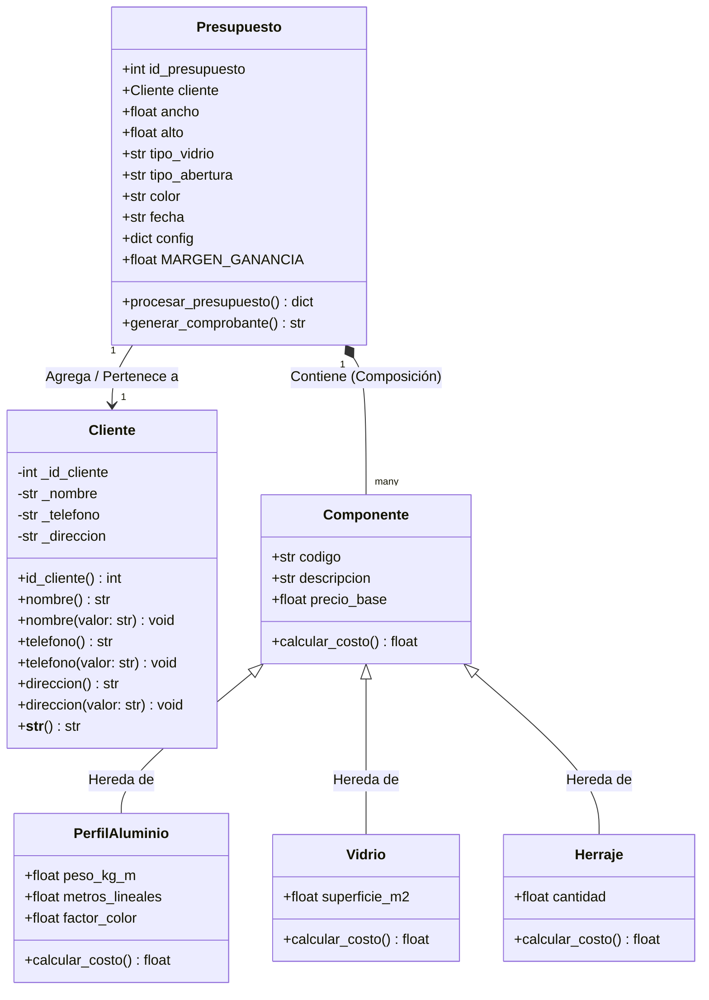

# Santy Aberturas - Sistema de Gestión y Presupuestos

Este proyecto es una aplicación de escritorio desarrollada en **Python** con **Tkinter** para la gestión de clientes y la realización automatizada de presupuestos técnicos de carpintería de aluminio para la empresa **Santy Aberturas**.

Este desarrollo forma parte del **Trabajo Práctico N.º 2** para la materia **Programación Avanzada** de la **Universidad Nacional Guillermo Brown (UNAB)**.

---

## 🚀 Tecnologías Utilizadas

* **Lenguaje:** Python 3.x
* **Interfaz Gráfica:** Tkinter (Librería nativa de GUI en Python)
* **Persistencia en la Nube:** Supabase (Base de datos PostgreSQL en la nube)
* **Envío de Emails:** Resend API (Notificaciones automáticas de presupuestos)
* **Gestión de Configuración:** Archivos JSON local (`config.json` para almacenamiento parametrizable de costos)
* **Decoradores e Introspección:** Librerías nativas `functools` e `inspect` para validación dinámica de datos

---

## 🏗️ Estructura del Código (MVC)

El proyecto está organizado de manera modular según la separación de responsabilidades:

```text
AberturasSanty/
│
├── main.py                 # Punto de entrada de la aplicación
├── config.json             # Configuración persistente de costos (generada automáticamente)
├── README.md               # Documentación obligatoria del proyecto
│
├── models/                 # Lógica de Negocio (Modelado de datos)
│   ├── __init__.py         # Módulo y lógica de consola (para pruebas de terminal)
│   ├── Cliente.py          # Clase Cliente (Encapsulamiento)
│   ├── Presupuesto.py      # Clase Presupuesto (Composición y Relación)
│   └── Componente.py       # Clase Base y Derivadas (Herencia y Polimorfismo)
│
├── services/               # Capa de Servicios y Controladores
│   ├── database.py         # Conexión remota con Supabase
│   ├── cliente_service.py  # CRUD de Clientes en base de datos
│   ├── presupuesto_service.py # Lógica de cálculo y almacenamiento de presupuestos
│   ├── export_service.py   # Exportación a TXT y envío de Emails vía Resend
│   ├── config_service.py   # Lectura y guardado de parámetros locales
│   └── decorators.py       # Decoradores para validación en tiempo de ejecución
│
└── views/                  # Interfaz Gráfica de Usuario (GUI)
    ├── clientes_gui.py     # Ventana ABM de Clientes
    ├── presupuestos_gui.py # Ventana para Generar Presupuestos
    └── configuracion_gui.py # Ventana de Configuración de precios
```

---

## 🏛️ Clases Principales

*   **`Cliente`:** Representa al destinatario del presupuesto. Gestiona los datos personales (nombre, teléfono, dirección) con validaciones mediante encapsulamiento.
*   **`Presupuesto`:** Clase central que orquestra el cálculo. Relaciona un cliente con las dimensiones de la abertura y gestiona la composición de materiales.
*   **`Componente`:** Clase abstracta/base que define la interfaz común para todos los elementos que forman parte de una abertura.
*   **`PerfilAluminio` (Hereda de `Componente`):** Especializada en el cálculo de costo por peso y tratamiento superficial (color).
*   **`Vidrio` (Hereda de `Componente`):** Especializada en el cálculo de costo por superficie (m²).
*   **`Herraje` (Hereda de `Componente`):** Representa accesorios fijos como cerraduras, ruedas o escuadras.

---

## 📐 Diagrama de Clases (UML)

El diseño del modelo de dominio sigue los principios de la Programación Orientada a Objetos:



---

## 💡 Conceptos de POO Aplicados

1. **Clases y Objetos:** Representación clara de las entidades del negocio: `Cliente`, `Presupuesto`, `Componente` (y sus derivados).
2. **Encapsulamiento:** En la clase `Cliente.py`, los atributos están protegidos con prefijo `_`. El acceso y modificación de los datos se hace a través de getters y setters utilizando `@property`, validando que el nombre no sea guardado con espacios vacíos o nulos.
3. **Herencia:** La clase `Componente` actúa como clase base de la cual heredan `PerfilAluminio`, `Vidrio` y `Herraje`, reutilizando el constructor base.
4. **Polimorfismo:** Cada subclase de `Componente` sobrescribe el método `calcular_costo()` de acuerdo a su propia lógica matemática (por peso de aluminio con factor de color, por metros cuadrados de vidrio, o por cantidad de kits de herrajes). En `Presupuesto.py` se calcula el costo total iterando de forma transparente sobre la lista genérica de componentes:
   ```python
   total_materiales = sum(comp.calcular_costo() for comp in componentes)
   ```
5. **Relaciones (Asociación y Composición):**
   - **Asociación:** Un `Presupuesto` se asocia a un `Cliente`.
   - **Composición:** Un `Presupuesto` está compuesto por múltiples objetos `Componente`.

---

## 🛠️ Funcionalidades

El sistema permite realizar una gestión integral del proceso de presupuestado:

1.  **Gestión de Clientes (ABM):** Registro, consulta, actualización y eliminación de clientes en la base de datos remota (Supabase).
2.  **Cálculo Técnico Automático:** Generación de presupuestos basados en medidas (ancho y alto), calculando automáticamente:
    *   **Perfiles de Aluminio:** Cantidad de metros lineales y peso según códigos técnicos (MO-101, HO-203, etc.).
    *   **Vidrios:** Superficie en m² y costo según el tipo seleccionado.
    *   **Herrajes e Insumos:** Inclusión automática de accesorios y porcentajes de desperdicio/insumos secundarios.
3.  **Configuración Dinámica:** Interfaz para actualizar precios de materiales (aluminio por kg, vidrios por m²) y margen de ganancia sin modificar el código fuente.
4.  **Generación de Comprobantes:** Creación de un resumen detallado del presupuesto en formato de texto plano para visualización inmediata.
5.  **Envío Automático por Email:** Integración con la API de **Resend** para el envío formal del presupuesto en formato HTML profesional directamente al cliente.
6.  **Persistencia en la Nube:** Sincronización en tiempo real de los datos de clientes para acceso multi-terminal.

---

## 📝 Ejemplos de Uso

### Caso: Presupuesto de Ventana Corrediza
1.  **Ingreso de Datos:** Se selecciona un cliente existente o se ingresan los datos de uno nuevo.
2.  **Medidas:** Se ingresa el ancho (ej. 1.50m) y el alto (ej. 1.10m).
3.  **Selección de Materiales:** Se elige el tipo de vidrio (ej. Float 4mm) y el color del aluminio (ej. Blanco).
4.  **Procesamiento:** El sistema calcula el peso de los perfiles necesarios, la superficie del vidrio y aplica el factor de costo por color.
5.  **Resultado:** Se muestra el costo total con el margen de ganancia aplicado y se genera el comprobante detallado.

---

## ⚙️ Instrucciones de Ejecución

### 1. Requisitos Previos
Asegúrate de tener instalado Python 3.10 o superior y las bibliotecas del sistema para Tcl/Tk (necesarias para Tkinter). En sistemas Ubuntu/Debian:
```bash
sudo apt-get install python3-tk
```

### 2. Configurar Entorno Virtual
Crea y activa el entorno virtual en la carpeta del proyecto:
```bash
python3 -m venv venv
source venv/bin/activate
```

### 3. Instalar Dependencias
Instala el conector de PostgreSQL necesario para Supabase:
```bash
pip install psycopg2-binary
```

### 4. Ejecutar la Aplicación
Corre el punto de entrada principal para iniciar la interfaz gráfica:
```bash
python main.py
```

*Nota:* Si deseas realizar pruebas rápidas directamente en la terminal de comandos (sin entorno gráfico), puedes ejecutar el módulo interactivo de consola:
```bash
python -m models
```

---

## 👥 Integrantes del Grupo
* **Nombre de Integrantes** johnny pintanel - santiago varela
